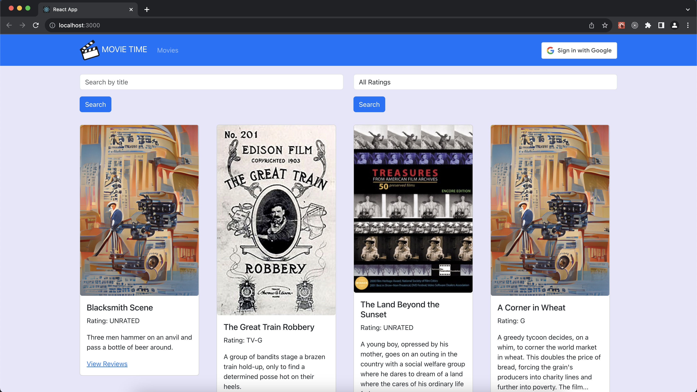
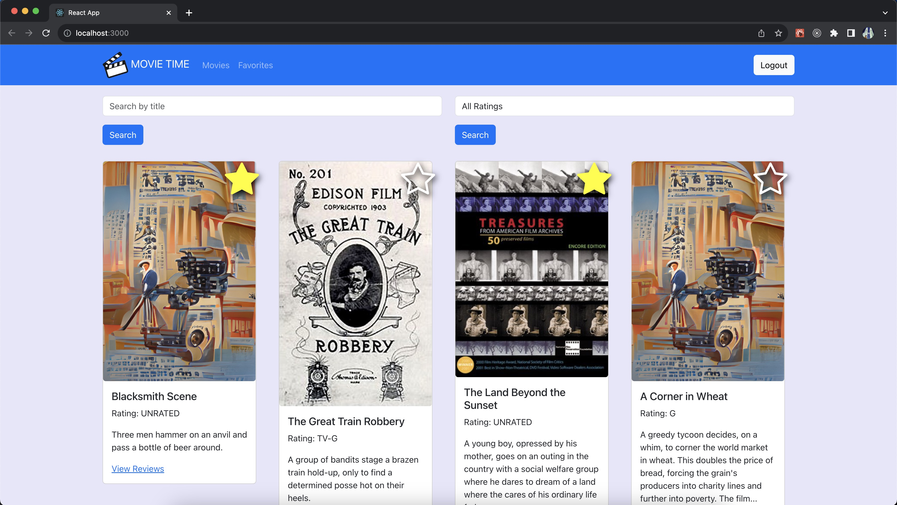
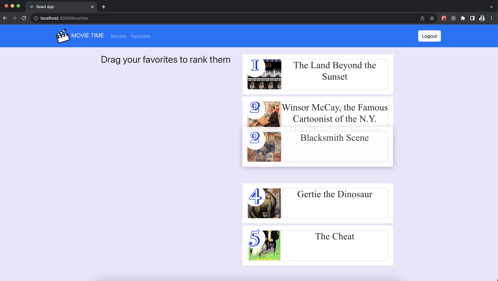
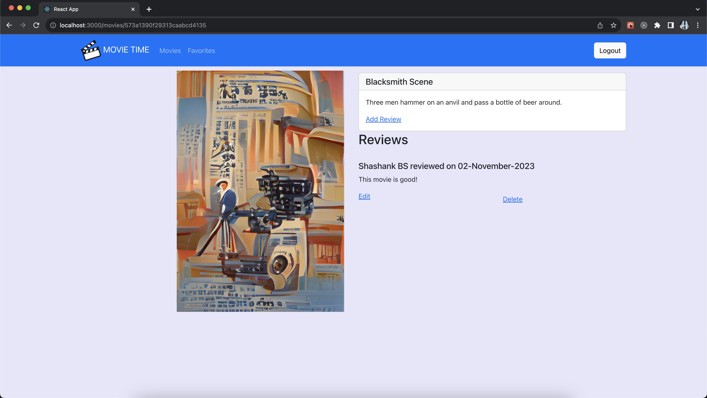

# MovieTime

App name: MovieTime

App Description:

It is a MERN stack application developed using React for the front-end, Node.js and Express for the backend and MongoDB for the database. It shows a list of movie cards which the user can interact with. 

## Features:

* Sign in with Google
* Search for movies by title
* Filter movies by rating
* Add movies to favorites list
* Re-order the favorites list by drag and drop
* Add, edit and delete reviews for movies

## Screenshots:

1. Movies list:

2. Add movies to favorites list:

3. Drag and drop movie cards to re-order them in the favorites list:

4. Add a review to a movie. Reviews can also be edited and deleted:

